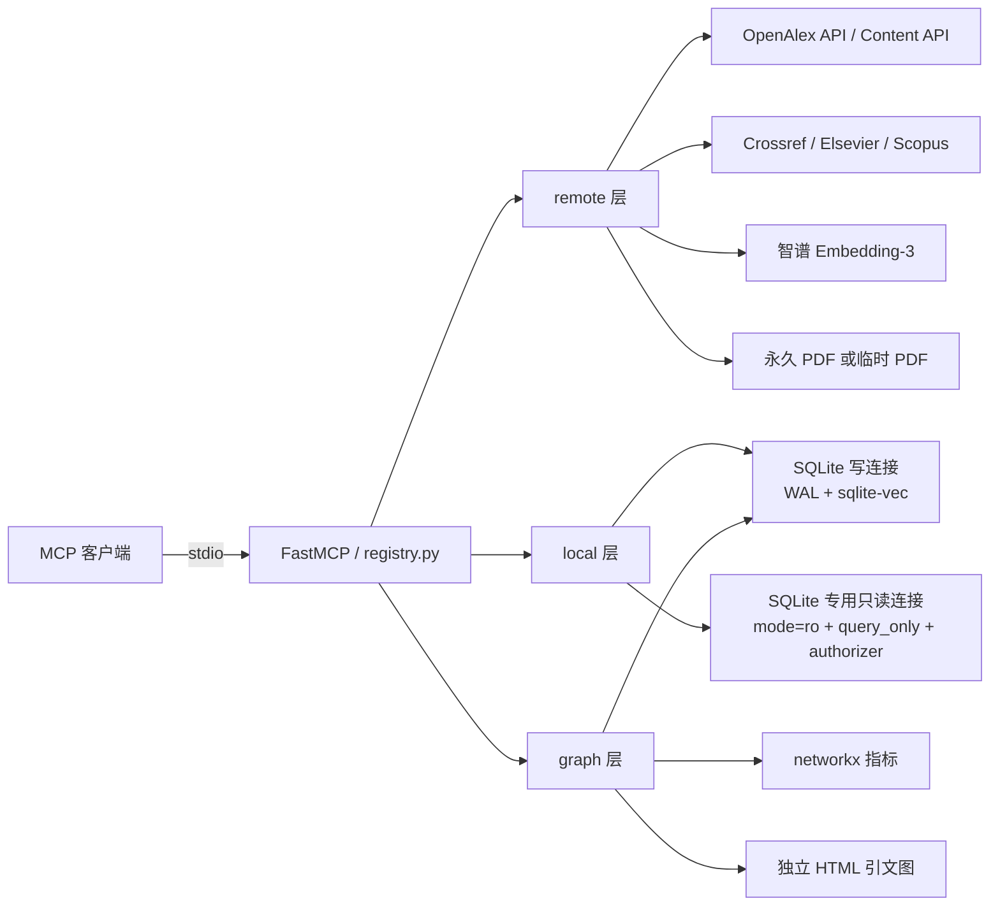
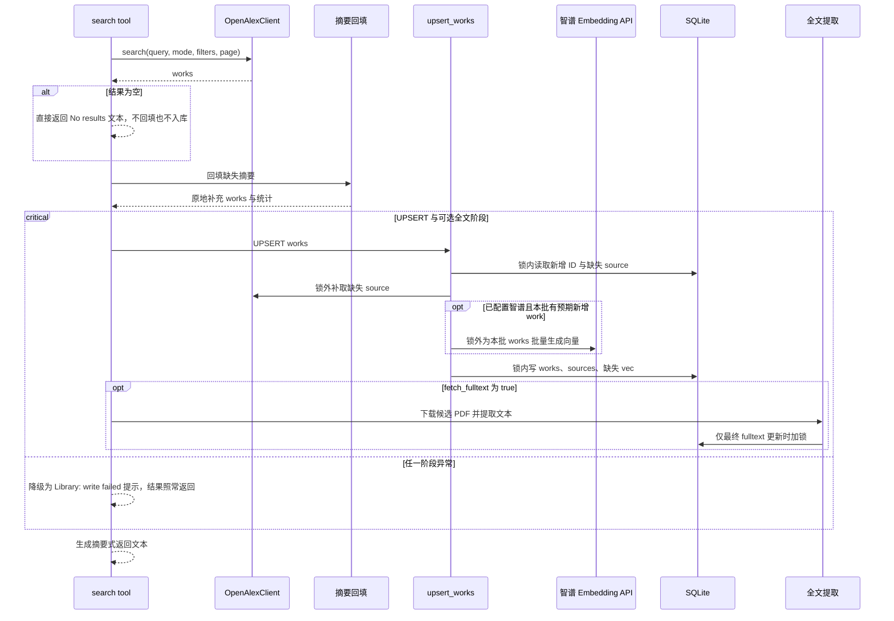
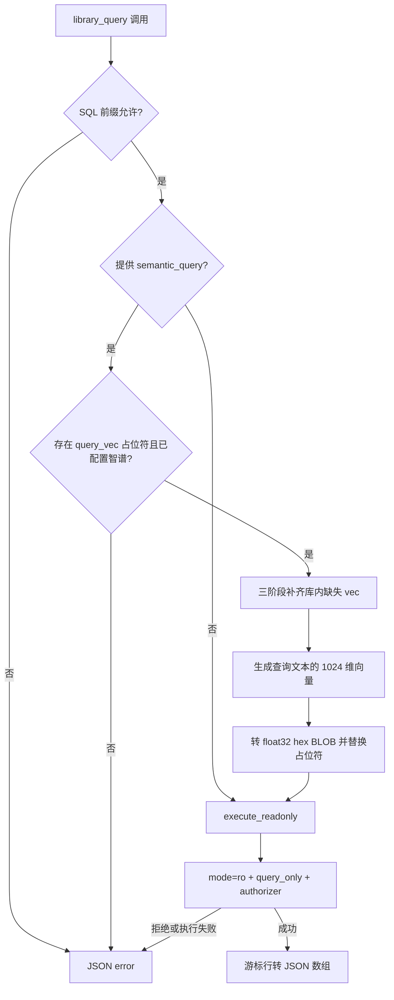
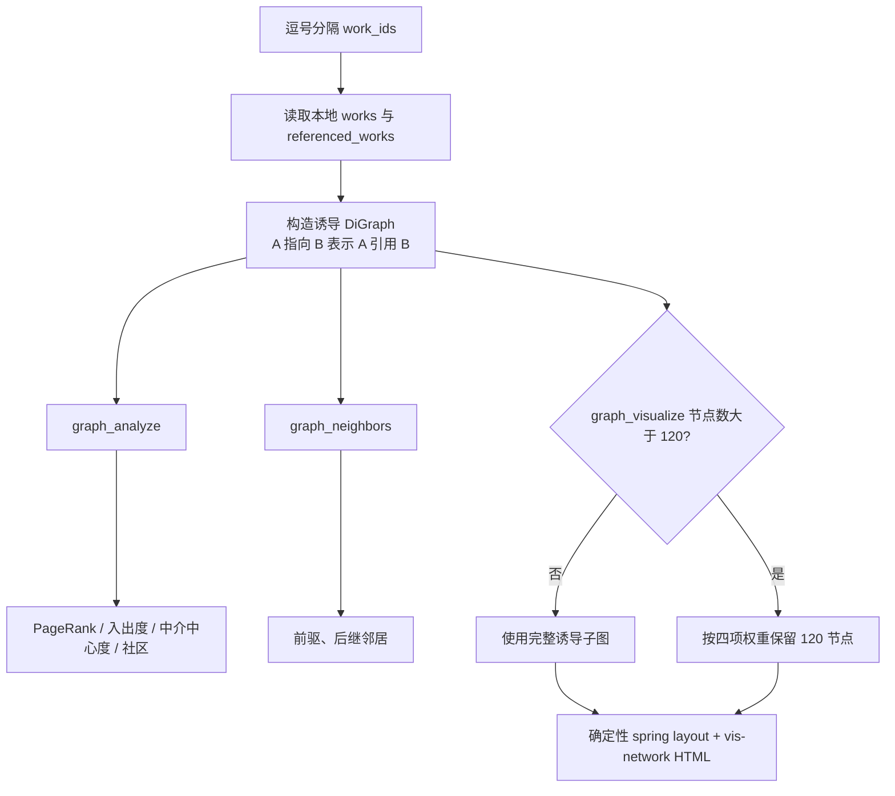

# Literature MCP Tool 工作原理

本文面向需要解释、审查或维护 Literature MCP 的读者，说明当前源码中 16 个 MCP tools 的真实执行路径。它不是参数速查表，也不替代 README 中的安装与客户端配置教程。

本文以当前实现为唯一事实依据。后文所说的“库”默认指 `~/.AI-CACHE/openalex/library.db`；“远端搜索”指 OpenAlex 服务端检索；“本地语义查询”指 SQLite 库内的 `sqlite-vec` 距离计算，两者不是同一套能力。

## 1. 范围与术语

- **MCP 注册层**：[`openalex_mcp/registry.py`](../openalex_mcp/registry.py)，负责 FastMCP tool 注册、参数模型、共享依赖获取、少量输入检查、返回格式和错误包装。
- **远端层**：[`openalex_mcp/remote/`](../openalex_mcp/remote/)，负责 OpenAlex、Crossref、Elsevier、Scopus、智谱 Embedding API 和 PDF 网络访问。
- **本地层**：[`openalex_mcp/local/`](../openalex_mcp/local/)，负责 SQLite schema、UPSERT、只读 SQL、统计、向量存储、删除和 BibTeX 导出。
- **图分析层**：[`openalex_mcp/graph/`](../openalex_mcp/graph/)，负责从本地引用关系构造 `networkx.DiGraph`、计算指标并生成 HTML。
- **work ID**：OpenAlex 论文 ID 的短形式，例如 `W2741809807`。数据库的 `works.id` 存短形式。
- **诱导子图**：只把调用者给出的、且已在本地库中的论文作为节点；只有引用边的两端都在该集合中时才保留该边。
- **写锁**：`LibraryManager` 延迟创建的进程内 `asyncio.Lock`，用于串行化明确走锁的写入阶段。它不是跨进程文件锁。
- **远端值**：本次 OpenAlex 返回并经过本地规范化后的字段值。

本文只描述当前行为，不承诺上游服务的长期费率、配额或响应格式。代码中已有的限制，例如单页结果数、单次 Elsevier 数量、全文提取上限和可视化 120 节点上限，也会明确指出。

## 2. 总体运行架构



图中 `registry.py` 是唯一 MCP 接口层，但大多数业务逻辑并不在注册函数里。进程启动时，`main()` 加载 `.env`，创建一个 `OpenAlexClient`、可选的 `EmbeddingClient` 和 `ElsevierClient`，再创建一个 `LibraryManager`，将它们保存为模块级共享实例并注册全部 tools。进程退出时，`atexit` 清理 HTTP 客户端和 SQLite 读写连接。

SQLite 写连接负责 schema 初始化、可信内部查询和所有写操作；`library_query` 的任意 SQL 单独走专用只读连接。两条连接都加载 `sqlite-vec`。WAL 允许已提交写入和读查询并行进行，专用只读连接会在后续语句中看到写连接的新提交。

### 2.1 通用 tool 调用生命周期

1. MCP 客户端通过 stdio 发送 tool 名称和 JSON 参数。
2. FastMCP 按 `registry.py` 中的 Python 类型标注和默认值完成协议层参数解析。
3. 注册函数取得共享客户端或共享 `LibraryManager`，执行该 tool 自己的校验和编排。
4. 网络调用原则上不占用数据库写锁；需要写库的阶段再取得 `asyncio.Lock`。
5. 实现函数返回 Markdown、普通字符串或 JSON 字符串。各 tool 的返回格式并不统一，调用方应按 tool 契约处理。
6. 错误处理也按 tool 区分：部分错误转换为 `Error: ...` 或 JSON `{"error": ...}`，部分网络或文件系统异常仍可能由 MCP 层报告。

## 3. 检索、摘要回填与入库共享链路

`search_keyword`、`search_semantic` 和 `search_ids` 最终都调用 [`remote/search.py`](../openalex_mcp/remote/search.py) 的 `_search_and_upsert()`。三者只在请求模式、参数和前置校验上不同，后续处理相同。



### 3.1 OpenAlex 请求

- `search_keyword` 使用 `search` 参数，每页最多 100 条。若 `query` 为空，则只提交结构化 filter，并改按 `cited_by_count:desc` 排序。
- `search_semantic` 使用 OpenAlex 的 `search.semantic` 参数，每页最多 50 条，并在客户端内保证语义请求之间至少间隔 1 秒。这是 OpenAlex 服务端能力，不使用本地 `vec`，也不依赖智谱。
- `search_ids` 把 work ID 和 DOI 编成 `/works?filter=openalex_id:...,...`，不带 page 和 sort。
- 公共 HTTP 客户端最多同时执行 10 个受信号量保护的请求。OpenAlex 的 429、500、502、503、504 和传输级网络错误最多尝试 5 次，等待时间按 1、2、4、8 秒递增；非重试型 HTTP 错误立即失败。
- 结构化过滤器由 [`remote/filters.py`](../openalex_mcp/remote/filters.py) 生成。字段名受检查，具体值和 page 下界主要由 OpenAlex 服务端判断。

### 3.2 `search_ids` 规范化

[`remote/client.py`](../openalex_mcp/remote/client.py) 在发送 HTTP 请求前逐项解析逗号分隔值：

- work ID 接受大小写不敏感的 `W` 加数字，以及 `https://openalex.org/W...`、带 `www` 或尾斜杠的形式，最终转为大写短 ID。
- DOI 接受裸 `10.<4-9 位 registrant>/<suffix>`、`doi:`、`https://doi.org/` 和 `http://dx.doi.org/` 形式；URL 百分号编码会先解码。
- work ID 和 DOI 分别保持首次出现的顺序去重；DOI 去重大小写不敏感，生成 filter 时先列 work ID 组，再列 DOI 组。
- 空输入或任意一项无效都会抛出 `ValueError`，整次调用不发 OpenAlex 请求，因此不会退化成无 `filter` 的 `/works` 查询。

### 3.3 自动摘要回填

[`remote/backfill.py`](../openalex_mcp/remote/backfill.py) 在入库前处理缺失摘要：

1. 先从 OpenAlex 的 `abstract_inverted_index` 重建普通文本。
2. 对仍无摘要且有 DOI 的 work，依次尝试 Crossref、Elsevier DOI Abstract Retrieval、Scopus DOI 检索后按 EID 获取摘要。
3. 不同 DOI 最多按 `BACKFILL_CONCURRENCY` 并发，当前环境值会被限制在 1 到 8；相同 DOI 只请求一次。
4. `BACKFILL_ABSTRACTS=false` 会关闭回填。缺摘要目标数超过非零的 `BACKFILL_MAX_TARGETS` 时，会先筛选有 DOI、期刊来源指向 Elsevier 的 work，按本批内 `cited_by_count` 降序取前 K 篇继续回填；没有这类目标时才跳过整批。
5. 排序主键是被引数，平手时较早年份优先，再用 work ID 保持稳定顺序。这里的 top K 使用 `BACKFILL_MAX_TARGETS`。
6. 回填失败、无 DOI 或上游异常都不会删除 work；失败只进入统计。自动回填仅修改本次内存中的 work，随后由 UPSERT 持久化。

### 3.4 UPSERT 和本地增强字段

[`local/upsert.py`](../openalex_mcp/local/upsert.py) 把入库拆成三阶段：锁内读取、锁外网络、锁内写入。锁外阶段会补取本地尚无记录的 source；若配置智谱，也会尝试生成标题、概念和关键词组成的 1024 维文献向量。摘要和 work ID 不进入当前文献向量文本。

`LibraryManager.upsert_work()` 的冲突更新规则如下：

| 字段组 | 重复检索时的规则 |
|---|---|
| 标题、年份、日期、类型、语言、DOI、作者、概念、关键词、source、引用与相关关系 | 用最新的非空远端值刷新；远端为空时保留已有值 |
| `cited_by_count`、`is_oa`、`oa_status`、`has_content`、`raw_json` | 每次按本轮规范化后的值刷新，包括默认或空状态 |
| `oa_url` | 最新非空 URL 覆盖，否则保留已有 URL |
| `abstract` | 仅在本地摘要为空时写入；已有非空摘要优先 |
| `fulltext`、`vec` | 不出现在冲突更新列表中，普通重复检索不会清空或覆盖 |

每个 work 的 `upsert_work()` 当前会自行提交；外层写锁覆盖整批写阶段，但不是把所有 work 合成一次 SQL 事务。单条失败会计数并继续。向量写入前会再次检查 `vec IS NULL`，避免覆盖已有或并发补齐的向量。`sources` 仅对本地尚不存在的 source 抓取，冲突时 `DO NOTHING`。

## 4. 摘要、PDF 与全文链路

### 4.1 自动回填与手动 Elsevier 的区别

自动回填是三种搜索的组成部分，数据源顺序为 Crossref、Elsevier、Scopus；`fetch_elsevier_abstracts` 是显式 tool，只调用 Elsevier 的 DOI Abstract Retrieval 接口，不执行 Crossref 或 Scopus fallback。手动 tool 可按 DOI 或本地 work ID 查找，默认只填本地空摘要，只有 `overwrite=true` 才替换已有摘要。

### 4.2 临时全文提取

当搜索 tool 设置 `fetch_fulltext=true` 时，[`remote/fulltext.py`](../openalex_mcp/remote/fulltext.py) 会：

1. 按 `best_oa_location`、`primary_location`、其余 `locations` 的顺序收集并去重直接 OA PDF URL。
2. 仅当 `use_openalex_content_api=true`、存在 OpenAlex API key 且元数据表明 `has_content.pdf` 时，才把付费 Content API 加为最后候选。
3. 按搜索结果顺序选择候选论文；调用参数再受现有 `MAX_FULLTEXT_WORKS=10` 上限约束。
4. 在 60 秒 HTTP 超时下逐篇尝试候选，检查响应类型或 `%PDF` 文件头。
5. 把 PDF 写入临时目录，最多解析 500 页、保留 300,000 字符；临时目录退出后 PDF 自动删除。
6. 网络和 PDF 解析都在写锁外完成，只有成功写 `works.fulltext` 时短暂加锁。

成功的显式全文提取会更新该 work 的 `fulltext`；“UPSERT 不覆盖全文”仅指普通元数据重复入库，不表示再次显式抓全文时禁止更新。

### 4.3 永久 PDF 下载

`download_pdf` 是永久保存路径。它先用 `search_ids` 模式批量取得标题与 `has_content.pdf`，随后逐篇调用 `content.openalex.org/works/{id}.pdf`。**严格默认**写入 `~/.AI-CACHE/openalex/pdfs/`；不得因上下文、Agent 偏好或任意路径请求改写目录。只有用户明确要求“保存到项目目录”时，才可设置 `save_to_project=true`，且仍只会写入固定的 `<project>/pdfs/`，不接受任意路径。已有同名文件直接跳过，不重复收费。

代码和 tool 说明按每个成功 Content API PDF 约 `$0.01` 估算，并在结果中只按本次实际下载数计算费用。上游费率可能变化，应以 OpenAlex 当期规则为准。

## 5. 本地 SQLite 与向量查询链路

### 5.1 数据库连接与 schema

[`local/manager.py`](../openalex_mcp/local/manager.py) 延迟建立两条持久连接：

- **写连接**：普通文件连接，启用 WAL、5 秒 `busy_timeout`，加载 `sqlite-vec`，创建 `works` 和 `sources`，并幂等补齐旧库可能缺少的 `referenced_works`、`related_works`、`fulltext` 列。
- **专用只读连接**：先确保写连接完成 schema 初始化，再以 SQLite URI `mode=ro` 打开；同样加载 `sqlite-vec`，然后设置 `PRAGMA query_only=ON` 和 authorizer。它只为 `library_query` 的调用者 SQL 服务，并复用到 `library_close` 或进程退出。

`works` 保存论文元数据、摘要、全文、引用 ID JSON、原始 JSON 和 float32 向量 BLOB；`sources` 保存期刊或来源的基本元数据。图分析直接读取 `works.referenced_works`，BibTeX 来源名优先通过 `works.source_id` 关联 `sources.display_name`。

### 5.2 数据库级只读防线

只读查询不是只靠字符串前缀判断，而是三层共同约束：

1. 注册层只接受以 `SELECT`、`PRAGMA`、`WITH`、`EXPLAIN` 开头的文本。
2. `mode=ro` 让 SQLite 文件连接本身无法写数据库。
3. authorizer 只允许 `SQLITE_SELECT`、`SQLITE_READ`、`SQLITE_FUNCTION`、`SQLITE_RECURSIVE`，并显式拒绝 `load_extension`。

authorizer 只放行以下只读 PRAGMA：`compile_options`、`database_list`、`foreign_key_list`、`index_info`、`index_list`、`index_xinfo`、`table_info`、`table_xinfo`。INSERT、UPDATE、DELETE、DDL、ATTACH、DETACH、修改型 PRAGMA、`PRAGMA query_only=OFF` 以及藏在 CTE 中的写操作都会被拒绝。

### 5.3 本地语义查询



调用者在 SQL 中写 `{query_vec}` 并同时提供 `semantic_query`。注册层先调用 `ensure_library_embeddings()` 补齐整个库的缺失文献向量；补齐失败只记录 warning，查询仍继续。随后单独嵌入最多前 3,000 个字符的查询文本，将向量转为 float32 字节并生成 SQLite `X'...'` BLOB，替换 SQL 中所有占位符。典型距离函数是 `vec_distance_cosine(vec, {query_vec})`，其返回值越小表示余弦距离越近。

文献向量补齐分为：锁内读取缺失项、锁外调用智谱、锁内批量写 BLOB。外层按 256 篇组织轮次，Embedding 客户端再按每请求最多 64 个文本切批；某个轮次失败后停止后续轮次，但会保存此前已成功生成的向量。

普通 SQL 不依赖 `ZHIPUAI_API_KEY`。`library_query` 成功返回 JSON 数组，不是 Markdown；拒绝和服务错误返回 JSON object，其中包含 `error`。当前实现没有 SQL 执行时间、行数或响应大小硬限制，调用大查询时应自行加 `LIMIT`，读取 `fulltext` 或 `raw_json` 时应使用有界 `substr()`。

## 6. 引文网络链路



[`graph/core.py`](../openalex_mcp/graph/core.py) 只按本地数据建图，不访问 OpenAlex。节点属性包括标题、年份、全局被引量、source 和作者；边来自 `referenced_works` JSON。`A -> B` 始终表示 A 引用 B，因此 B 的集合内入度表示所选集合中有多少论文引用它，A 的出度表示它引用了多少集合内论文。

[`graph/metrics.py`](../openalex_mcp/graph/metrics.py) 计算 PageRank、入度、出度、中介中心度、弱连通分量、孤立节点，并在无向版本上划分社区。社区编号按社区大小排序，最大社区为 0。`graph_analyze` 不设节点数硬限制；小图使用精确中介中心度和 greedy modularity，超过阈值的大图改用确定性抽样中介中心度和 Louvain 启发式社区划分，并在 Markdown 中标注。

`graph_visualize` 在库内节点超过 120 时才筛选。四项都先归一化到 `[0, 1]`，然后计算：

```text
importance = 0.50 * log(1 + 全局被引量)
           + 0.25 * PageRank
           + 0.15 * log(1 + 集合内入度)
           + 0.10 * 年代分数
```

年代分数越老越高，用于表达“奠基性年份”，不是论文质量判断。PageRank 不收敛时，筛选阶段退化为入度代理。取前 120 个节点后重新形成子图并重新划分社区，所以被隐藏节点相关的边不会进入 HTML。

[`graph/visualize.py`](../openalex_mcp/graph/visualize.py) 用固定 seed 的 `spring_layout` 预计算坐标，再让浏览器短暂运行 Barnes-Hut 物理布局；稳定后或约 6 秒后自动冻结。节点颜色编码发表年份，大小是全局被引量的对数缩放，社区显示在 tooltip 和图例中。项目内置 `vis-network` 并内联到 HTML，缺失时才依次尝试 CDN。

## 7. 16 个 tools 对照总表

| # | Tool | 主要输入 | 返回 | 持久化或文件副作用 | 主要外部依赖 |
|---:|---|---|---|---|---|
| 1 | `search_keyword` | 关键词、结构化 filters、page、全文选项 | 摘要式文本 | UPSERT；可选写 `fulltext` | OpenAlex；可选 Crossref、Elsevier、Scopus、智谱、PDF 来源 |
| 2 | `search_semantic` | 自然语言、结构化 filters、page、全文选项 | 摘要式文本 | 同上 | OpenAlex 服务端语义搜索；其余同上 |
| 3 | `search_ids` | DOI/work ID 列表、全文选项 | 摘要式文本或 `Error:` | 同上 | OpenAlex；其余同上 |
| 4 | `autocomplete` | entity type、名称片段 | Markdown | 无 | OpenAlex autocomplete |
| 5 | `download_pdf` | work IDs；仅用户明确要求项目目录时的 `save_to_project` | Markdown 表格 | 永久 PDF | OpenAlex 元数据与 Content API |
| 6 | `fetch_elsevier_abstracts` | DOI/work ID、回写和覆盖选项 | Markdown | 可选更新摘要 | Elsevier Abstract Retrieval |
| 7 | `library_query` | 只读 SQL、可选语义文本 | JSON | 语义模式可补齐 `vec` | 普通 SQL 无远端依赖；语义模式用智谱 |
| 8 | `library_stats` | 无 | Markdown | 无 | 无 |
| 9 | `library_generate_embeddings` | 无 | 状态文本 | 补齐 `vec` | 智谱 Embedding-3 |
| 10 | `library_export` | IDs、`.bib` 文件名、排序、cite key | 状态文本或 `Error:` | 写 BibTeX | 无 |
| 11 | `literature_review_prompt` | 无 | 中文综述系统提示词 | 无 | 无 |
| 12 | `library_delete` | IDs 或 `*` | 状态文本或 `Error:` | 删除数据库行 | 无 |
| 13 | `library_close` | 无 | 状态文本 | 关闭读写连接 | 无 |
| 14 | `graph_analyze` | work IDs | Markdown | 无 | 无 |
| 15 | `graph_neighbors` | work IDs、方向 | Markdown | 无 | 无 |
| 16 | `graph_visualize` | work IDs、可选目录 | 路径及说明文本 | 写 HTML | 无；HTML 通常内置前端库 |

以下小节补充每个 tool 相对共享链路的差异。所有 tool 的 MCP 入口都在 [`registry.py`](../openalex_mcp/registry.py)，元数据形状统一由 [`test_tool_metadata.py`](../tests/test_tool_metadata.py) 覆盖。

### 7.1 `search_keyword`

- **定位与实现**：精确关键词、布尔表达式或按实体 filter 检索；实现位于 [`remote/search.py`](../openalex_mcp/remote/search.py)，请求构造位于 [`remote/client.py`](../openalex_mcp/remote/client.py)。
- **校验与步骤**：默认 `publication_year=">2021"`；query 可为空。结构化 filter 字段受校验，随后走公共搜索、回填、UPSERT、可选全文链路。
- **状态与依赖**：依赖 OpenAlex；正常结果自动入库。若配置智谱，可在入库时填缺失向量；摘要和全文选项可能触发其他服务。
- **返回与错误**：返回本页数量、前 5 条预览、入库和回填状态。注册层捕获所有搜索异常并返回中文“搜索失败”文本。
- **安全、性能与费用**：每页最多 100 条；无关键词时按被引量降序。直接 OA 全文通常不走 Content API，显式允许 Content fallback 才可能产生相应费用。
- **测试**：共享参数兼容性见 [`test_tool_metadata.py`](../tests/test_tool_metadata.py)；回填与全文分支分别见 [`test_backfill.py`](../tests/test_backfill.py) 和 [`test_fulltext.py`](../tests/test_fulltext.py)。当前没有独立的 keyword 请求参数回归测试。

### 7.2 `search_semantic`

- **定位与实现**：把研究想法或段落交给 OpenAlex 的 `search.semantic`；不是本地向量查询。
- **校验与步骤**：`query` 必填，其他 filter 与 keyword 模式相同；代码不在本地截断查询长度，服务端约束由 OpenAlex 决定。后续仍走公共回填、UPSERT 和全文链路。
- **状态与依赖**：远端语义检索只依赖 OpenAlex；仅入库向量和后续本地语义查询才依赖智谱。
- **返回与错误**：返回与 keyword 相同的摘要结构；注册层捕获所有异常并给出重试或改用普通检索的提示。
- **安全、性能与费用**：每页最多 50 条，同一客户端语义请求至少间隔 1 秒。筛选规模仍由调用者通过 page 和 filter 控制。
- **测试**：参数形状由 [`test_tool_metadata.py`](../tests/test_tool_metadata.py) 固定；当前没有实际调用 OpenAlex 语义端点的自动化测试，以避免外部 API。

### 7.3 `search_ids`

- **定位与实现**：按已知 OpenAlex work ID 或 DOI 精确取回论文；规范化在 [`remote/client.py`](../openalex_mcp/remote/client.py)。
- **校验与步骤**：逐项百分号解码、识别 URL/前缀、正则校验、去重，再生成 OpenAlex filter；任意坏值使整批在 HTTP 前失败。
- **状态与依赖**：依赖 OpenAlex，成功结果自动入库，并可进入摘要、向量和全文共享链路。
- **返回与错误**：参数 `ValueError` 转成 `Error: ...`。注册层只专门捕获该类错误，其他未处理异常可能由 MCP 层报告。
- **安全、性能与费用**：单次 `per_page=100`，无分页。严格校验防止空 filter 意外拉取普通 `/works` 结果。
- **测试**：[`test_openalex.py`](../tests/test_openalex.py) 覆盖合法形式、混合去重、纯无效和部分无效输入均不发 HTTP。

### 7.4 `autocomplete`

- **定位与实现**：把作者、source、机构、出版社或资助方名称解析为 OpenAlex ID；实现位于 [`remote/autocomplete.py`](../openalex_mcp/remote/autocomplete.py)。
- **校验与步骤**：`entity_type` 只接受 `authors`、`sources`、`institutions`、`publishers`、`funders`；调用 `/autocomplete/{entity_type}`，最多展示前 10 条。
- **状态与依赖**：只依赖 OpenAlex，不读写本地库。
- **返回与错误**：返回含 ID、名称、提示、works/citations 和下一步 filter 示例的 Markdown。未知类型以及捕获到的 `ValueError`/`RuntimeError` 返回 `Error:`。
- **安全、性能与费用**：轻量 typeahead，不触发论文入库；源码说明其不按完整 search 计费，实际政策以上游为准。
- **测试**：参数和必填项由 [`test_tool_metadata.py`](../tests/test_tool_metadata.py) 覆盖；当前没有 endpoint 格式化专测。

### 7.5 `download_pdf`

- **定位与实现**：永久保存 OpenAlex Content API PDF；实现位于 [`remote/download.py`](../openalex_mcp/remote/download.py)。
- **校验与步骤**：拒绝空列表和不以 `W` 开头的值，随后 `search_ids` 的严格解析会进一步要求 `W` 加数字；批量取元数据、跳过无 PDF 或已有文件、逐篇下载。
- **状态与依赖**：严格默认写 `~/.AI-CACHE/openalex/pdfs/W....pdf`。只有用户明确要求项目目录时的 `save_to_project=true` 才改为固定 `<project>/pdfs/W....pdf`；不允许任意目录，也不更新 SQLite。需要 OpenAlex Content API 和有效 key。
- **返回与错误**：Markdown 表格逐篇给出 downloaded、already downloaded、no cached PDF、not found 或失败状态，并给出路径与估算费用。部分非预期 HTTP/文件错误仍可能上抛。
- **安全、性能与费用**：下载受公共 10 并发信号量约束，但本 tool 当前逐篇等待；已有文件不重复请求。源码按成功文件 `$0.01` 估算。
- **测试**：接口形状由 [`test_tool_metadata.py`](../tests/test_tool_metadata.py) 覆盖；当前没有真实或 mock Content API 下载回归测试。

### 7.6 `fetch_elsevier_abstracts`

- **定位与实现**：显式从 Elsevier 按 DOI 获取摘要；客户端与解析器位于 [`remote/elsevier.py`](../openalex_mcp/remote/elsevier.py)，编排在 `registry.py`。
- **校验与步骤**：query 非空且最多 25 项；`input_type` 接受 DOI 或 work ID 的若干单复数别名。work ID 模式先查本地 DOI；DOI 模式只做前缀/URL规范化，非空字符串并未进行与 `search_ids` 相同的 DOI 正则校验。
- **状态与依赖**：要求 `ELSEVIER_API_KEY`，可选 `ELSEVIER_INST_TOKEN`。默认逐项把摘要写入匹配的空本地行；`overwrite=true` 才覆盖。
- **返回与错误**：Markdown 逐项列 DOI、标题、source、完整摘要和本地更新结果；404、空摘要及其他异常都转换为该项状态，不中断整个批次。
- **安全、性能与费用**：最多 25 项且顺序执行；更新动作逐项短暂取得写锁。Elsevier 配额和机构权限由账号决定。
- **测试**：[`test_backfill.py`](../tests/test_backfill.py) 覆盖共用 Elsevier/Scopus 解析链路的一部分；当前没有手动 tool 的 25 项、overwrite 和逐项报告专测。

### 7.7 `library_query`

- **定位与实现**：执行任意规模的本地只读 SQLite 查询，也承担库内向量检索；注册编排在 `registry.py`，连接安全在 [`local/manager.py`](../openalex_mcp/local/manager.py)。
- **校验与步骤**：前缀允许 SELECT/PRAGMA/WITH/EXPLAIN；语义模式要求 `{query_vec}` 和智谱客户端，先补齐文献向量，再注入查询向量并走 `execute_readonly()`。
- **状态与依赖**：普通 SQL 无远端依赖且不写库；语义模式会调用智谱并可能写缺失 `vec`。查询本身不取得写锁。
- **返回与错误**：成功固定返回 JSON 数组；所有前置、嵌入和 SQLite 拒绝错误返回含 `error` 的 JSON object。BLOB 等非 JSON 原生值通过 `default=str` 序列化。
- **安全、性能与费用**：`mode=ro`、`query_only`、authorizer 三层保护；没有行数、时间和响应大小硬限制。语义模式会产生智谱 API 调用与相应配额消耗。
- **测试**：[`test_storage.py`](../tests/test_storage.py) 覆盖 SELECT、WITH SELECT、允许的 PRAGMA、`vec_distance_cosine`、后续 WAL 提交可见、连接复用与危险语句拒绝；[`test_tool_metadata.py`](../tests/test_tool_metadata.py) 还覆盖 tool 级 CTE DELETE 拒绝。

### 7.8 `library_stats`

- **定位与实现**：汇总本地库规模和覆盖率；SQL 与概念聚合位于 [`local/stats.py`](../openalex_mcp/local/stats.py)。
- **校验与步骤**：无参数。读取总数、年份范围、摘要/全文/向量/OA 数量、Top 10 sources，并在 Python 中解析 `concepts_json` 统计 Top 10 concepts。
- **状态与依赖**：只读本地写连接，不访问网络，也不修改数据库。当前 registry wrapper 未显式取得 `asyncio.Lock`。
- **返回与错误**：空库返回提示；非空返回 Markdown。实现没有专门错误包装，SQLite 异常会由 MCP 层报告。
- **安全、性能与费用**：无外部费用；concept 统计会把所有非空 `concepts_json` 读入并解析，库很大时耗时和内存随论文数增长。
- **测试**：参数零输入由 [`test_tool_metadata.py`](../tests/test_tool_metadata.py) 覆盖；当前没有统计值和 Markdown 的专门回归测试。

### 7.9 `library_generate_embeddings`

- **定位与实现**：主动补齐所有 `vec IS NULL` 的文献向量；实现位于 [`local/search.py`](../openalex_mcp/local/search.py) 和 [`remote/embeddings.py`](../openalex_mcp/remote/embeddings.py)。
- **校验与步骤**：无参数；未配置智谱时立即返回提示。否则执行锁内读取、锁外批量 embedding、锁内批量写入。
- **状态与依赖**：写 `works.vec`，依赖 `ZHIPUAI_API_KEY`；文本由标题、concepts、keywords 组成，最大 3,000 字符、默认 1024 维 float32。
- **返回与错误**：区分空库、已经全部有向量和本次新生成数量。单批 API 失败会记录日志并停止后续批次，而不是把已有向量清空。
- **安全、性能与费用**：外层每轮 256 篇，HTTP 客户端每请求最多 64 篇；网络阶段不占写锁。大库会产生与缺失向量数成比例的智谱调用和费用。
- **测试**：接口形状由 [`test_tool_metadata.py`](../tests/test_tool_metadata.py) 覆盖；[`test_storage.py`](../tests/test_storage.py) 间接验证 BLOB 向量能保存且 UPSERT 不覆盖，当前没有 mock 智谱批处理专测。

### 7.10 `library_export`

- **定位与实现**：从本地列生成 BibTeX；路径控制位于 [`local/manage.py`](../openalex_mcp/local/manage.py)，排序和条目生成位于 [`local/export.py`](../openalex_mcp/local/export.py) 与 [`local/bibtex.py`](../openalex_mcp/local/bibtex.py)。
- **校验与步骤**：`work_ids="*"` 表示全部，否则使用逗号分隔 ID。target 必须是当前层级的单一 `.bib` 文件名；sort 只接受一个 `column[:asc|desc]`；cite key 只接受 `author_year` 或 `openalex_id`。
- **状态与依赖**：读取本地库并以 UTF-8 写入 `~/.AI-CACHE/openalex/collections/`；无网络依赖。默认按 publication year 降序，author-year key 冲突时追加 `a`、`b` 等后缀。
- **返回与错误**：成功返回条目数和路径；空结果或参数非法返回普通文本/`Error:`。目标文件写入的文件系统错误未统一转换。
- **安全、性能与费用**：拒绝绝对路径、子目录、`..`、非 `.bib` 后缀和解析后不在 collections 直属目录的目标；已有符号链接若指向目录外也会被拒绝。允许排序字段仅为 `id`、`title`、`publication_year`、`publication_date`、`cited_by_count`、`source_name`、`is_oa`。
- **测试**：[`test_export_safety.py`](../tests/test_export_safety.py) 覆盖合法导出、目录逃逸、绝对路径、子目录、后缀、符号链接和非法 sort；[`test_bibtex.py`](../tests/test_bibtex.py) 覆盖条目类型、cite key 和 DOI/URL。

### 7.11 `literature_review_prompt`

- **定位与实现**：返回固定的中文系统提示词；模板位于 [`review.py`](../openalex_mcp/review.py)，MCP 注册位于 [`registry.py`](../openalex_mcp/registry.py)。
- **校验与步骤**：无参数、无文件读取。调用后由外层模型取得会话中已提供的 BibTeX，或自行读取本地导出的 `.bib` 文件，再按提示词撰写综述。
- **状态与依赖**：无数据库、网络或文件副作用，也不调用任何模型服务。
- **返回与错误**：返回方法递进、作者姓名与 `\cite{key}` 引用格式、总结与证据边界要求；没有运行时可预期错误。
- **安全、性能与费用**：提示词不接收或存储 BibTeX，因而不会扩大本地文件访问边界；调用为常数时间且无外部费用。
- **测试**：[`test_tool_metadata.py`](../tests/test_tool_metadata.py) 覆盖零参数元数据与提示词中的引用格式、方法演进和 BibTeX 要求。

### 7.12 `library_delete`

- **定位与实现**：显式删除本地论文；实现位于 [`local/manage.py`](../openalex_mcp/local/manage.py) 和 [`local/manager.py`](../openalex_mcp/local/manager.py)。
- **校验与步骤**：`*` 清空 works 和 sources；否则解析非空逗号分隔 ID，执行一次 `DELETE ... WHERE id IN (...)`。
- **状态与依赖**：注册层在整个删除调用期间取得写锁。`vec`、摘要和全文随 works 行一起删除；全清时 source 表也清空。
- **返回与错误**：返回实际删除数和剩余数；空 ID 列表返回 `Error:`。不存在和重复 ID 不会虚增计数，因为使用 DELETE cursor 的 `rowcount`。
- **安全、性能与费用**：不可恢复，只有用户明确要求时才应调用；无网络费用。当前不会规范化 URL 形式的 ID。
- **测试**：[`test_storage.py`](../tests/test_storage.py) 覆盖存在、不存在和重复 ID 的实际计数；tool 元数据测试固定 `work_ids` 必填。全清返回文案尚无专测。

### 7.13 `library_close`

- **定位与实现**：维护操作，释放 SQLite 读写连接；实现位于 `registry.py` 和 `LibraryManager.close()`。
- **校验与步骤**：无参数；先取得写锁，再依次关闭专用只读连接和写连接并把引用设回 `None`。
- **状态与依赖**：不删数据库文件或行，也不关闭远端 HTTP 客户端。后续任一数据库访问会按需重新建连接、加载扩展并复用原文件。
- **返回与错误**：正常返回连接已关闭；关闭异常没有额外包装。
- **安全、性能与费用**：用于需要其他程序访问数据库文件的场景，不是常规搜索步骤；重连会重新执行幂等 schema 检查。
- **测试**：[`test_storage.py`](../tests/test_storage.py) 验证旧读写连接均失效、后续生成新连接且数据仍在；tool 的零参数形状由元数据测试覆盖。

### 7.14 `graph_analyze`

- **定位与实现**：分析所选论文之间的内部引用结构；建图见 [`graph/core.py`](../openalex_mcp/graph/core.py)，指标见 [`graph/metrics.py`](../openalex_mcp/graph/metrics.py)。
- **校验与步骤**：`work_ids` 必填且拆分后非空；当前只去空白，不校验 `W` 格式或去重。缺失 ID 被忽略并在末尾报告。
- **状态与依赖**：只读本地库，不访问网络、不写文件。构造完整诱导子图后计算 PageRank、度、中介中心度和社区。
- **返回与错误**：返回 Markdown；空输入和空图转为说明文本。部分 networkx 算法异常仍可能上抛。
- **安全、性能与费用**：无节点硬限制和外部费用。大图会自适应使用近似中介中心度和 Louvain 社区划分；图越大，PageRank、输出体积和剩余图操作的 CPU/内存成本仍会升高。
- **测试**：元数据测试覆盖必填参数；图指标测试覆盖小图精确路径和大图自适应提示。

### 7.15 `graph_neighbors`

- **定位与实现**：查看所选集合内某些论文的入邻居和出邻居；实现位于 [`graph/metrics.py`](../openalex_mcp/graph/metrics.py) 的 `get_neighbors()`。
- **校验与步骤**：work IDs 先用于构造同一个诱导子图；direction 只接受 `in`、`out`、`both`，大小写会规范化。要看到另一篇论文作为邻居，必须把它也放进本次 work ID 集合。
- **状态与依赖**：只读本地库，无网络和文件副作用。
- **返回与错误**：Markdown 按 work 展示前驱与后继；缺失论文逐项注明。错误方向转换为文本，不抛给调用者。
- **安全、性能与费用**：无外部费用；主要成本是读取所选行和建图，通常低于完整指标分析。
- **测试**：元数据测试覆盖 `direction="both"` 默认值；当前没有 in/out 边方向的专门测试。

### 7.16 `graph_visualize`

- **定位与实现**：生成可交互引文网络 HTML；筛选编排在 [`graph/__init__.py`](../openalex_mcp/graph/__init__.py)，渲染在 [`graph/visualize.py`](../openalex_mcp/graph/visualize.py)。
- **校验与步骤**：work IDs 规则同其他图 tool；没有库内节点时返回说明。超过 120 节点时按 50/25/15/10 权重筛选，再计算社区、布局和 HTML。
- **状态与依赖**：默认写 `~/.AI-CACHE/openalex/graphs/graph_<digest>_<N>n.html`；自定义 `output_dir` 不做 collections 式路径限制。数据库只读，无远端数据请求。
- **返回与错误**：返回生成路径、视觉编码和截断说明；默认目录产生绝对路径，自定义相对目录会按传入形式返回。文件系统或布局异常没有统一包装。
- **安全、性能与费用**：无 API 费用。Python 预布局固定执行最多 200 次迭代，浏览器物理模拟稳定或约 6 秒后冻结；完整大集合的分析仍应使用 `graph_analyze`。
- **测试**：元数据测试覆盖必填 ID 和可选目录；当前没有 120 节点筛选权重、HTML 内容或离线资源的自动化测试。

## 8. 安全、并发、性能与费用边界

### 8.1 安全边界

- 任意 SQL 通过专用只读连接执行；字符串前缀检查只是早期提示，SQLite authorizer 才负责阻止隐藏写入。
- `library_export` 和 `download_pdf` 都限制输出位置：前者仅允许 collections 下的单一 `.bib` 文件名；后者严格默认写入 `~/.AI-CACHE/openalex/pdfs/`，仅在用户明确要求项目目录时可写入固定 `<project>/pdfs/`。`graph_visualize` 的自定义输出目录仍由调用者明确指定。
- `library_delete` 是不可恢复操作；`library_close` 只关连接，不删数据。
- 自动摘要回填和全文抓取失败不会把搜索结果从入库集合中移除。
- 重复搜索不会清空 `fulltext` 或 `vec`，也不会替换已有非空摘要。

### 8.2 并发模型

- OpenAlex 客户端用信号量把受控 HTTP 并发限制为 10；摘要自动回填另有 1 到 8 的 DOI pipeline 并发。
- `LibraryManager` 的 `asyncio.Lock` 只保护明确取得它的同一进程写阶段。网络请求尽量在锁外执行。
- WAL 让 `library_query` 的专用连接与写连接并发工作；每条查询按 SQLite 自身快照语义看到已提交数据。
- 当前 `library_stats`、`library_export` 和图读取使用可信写连接且 wrapper 未显式加锁；它们不会主动修改数据库，但与其他写操作的协调依赖 SQLite 和单线程事件循环中的同步执行段。

### 8.3 性能与规模

- 本地 SQL、响应行数和 `graph_analyze` 没有新增硬限制。调用者应对大列使用 `substr()`，对结果集使用 `LIMIT`。
- `library_stats` 的 concept 统计、全库 embedding 补齐和大规模图分析仍会随库规模增长；`graph_analyze` 的大图中介中心度和社区检测会自动切到近似/启发式算法。
- `graph_visualize` 只限制最终展示节点为 120；为了排名，它仍需先构造原始诱导图并计算 PageRank。
- 全文提取现有限制为每次最多 10 篇、每篇最多 500 页和 300,000 字符；这是已有实现边界，不是 SQL 响应限制。

### 8.4 外部依赖与费用

| 能力 | 必需配置 | 可能的配额或费用 |
|---|---|---|
| 本地 SQL、统计、导出、删除、连接维护、引文分析 | 无 API key | 无外部 API 费用 |
| OpenAlex 关键词、服务端语义、ID 检索、autocomplete | 网络可达；代码会在无 key 时尝试，但服务策略可能限制 | 按 OpenAlex 当前政策 |
| 本地向量生成和语义查询 | `ZHIPUAI_API_KEY` | 按 Embedding-3 调用量 |
| 手动 Elsevier 摘要 | `ELSEVIER_API_KEY`，可能还需 `ELSEVIER_INST_TOKEN` | 按账号、机构权限和上游配额 |
| 直接 OA PDF 全文提取 | 可访问的 OA PDF URL | 通常无 OpenAlex Content API 费用 |
| Content API PDF 下载或显式 fallback | `OPENALEX_API_KEY` | 源码按成功 PDF 约 `$0.01` 说明，以上游当期费率为准 |

## 9. 实现与测试索引

### 9.1 实现文件

| 主题 | 主要文件 |
|---|---|
| MCP 注册、参数、返回包装、进程生命周期 | [`openalex_mcp/registry.py`](../openalex_mcp/registry.py) |
| OpenAlex 请求、ID/DOI 规范化、重试 | [`openalex_mcp/remote/client.py`](../openalex_mcp/remote/client.py) |
| 三种搜索共享编排 | [`openalex_mcp/remote/search.py`](../openalex_mcp/remote/search.py) |
| 自动摘要回填和 Elsevier 客户端 | [`openalex_mcp/remote/backfill.py`](../openalex_mcp/remote/backfill.py)、[`openalex_mcp/remote/elsevier.py`](../openalex_mcp/remote/elsevier.py) |
| PDF 永久下载与临时全文提取 | [`openalex_mcp/remote/download.py`](../openalex_mcp/remote/download.py)、[`openalex_mcp/remote/fulltext.py`](../openalex_mcp/remote/fulltext.py) |
| 智谱客户端和向量文本 | [`openalex_mcp/remote/embeddings.py`](../openalex_mcp/remote/embeddings.py)、[`openalex_mcp/local/embedding.py`](../openalex_mcp/local/embedding.py) |
| SQLite、只读 authorizer、UPSERT | [`openalex_mcp/local/manager.py`](../openalex_mcp/local/manager.py)、[`openalex_mcp/local/upsert.py`](../openalex_mcp/local/upsert.py) |
| 向量补齐、统计、删除、导出 | [`openalex_mcp/local/search.py`](../openalex_mcp/local/search.py)、[`openalex_mcp/local/stats.py`](../openalex_mcp/local/stats.py)、[`openalex_mcp/local/manage.py`](../openalex_mcp/local/manage.py)、[`openalex_mcp/local/export.py`](../openalex_mcp/local/export.py) |
| 引文图构造、指标与 HTML | [`openalex_mcp/graph/core.py`](../openalex_mcp/graph/core.py)、[`openalex_mcp/graph/metrics.py`](../openalex_mcp/graph/metrics.py)、[`openalex_mcp/graph/visualize.py`](../openalex_mcp/graph/visualize.py) |

### 9.2 当前自动化测试

| 测试文件 | 覆盖重点 |
|---|---|
| [`tests/test_tool_metadata.py`](../tests/test_tool_metadata.py) | 恰好 16 个 tools、参数集合、必填项、关键默认值、tool 级只读 SQL |
| [`tests/test_openalex.py`](../tests/test_openalex.py) | `search_ids` 规范化、去重、整批拒绝且不发 HTTP |
| [`tests/test_backfill.py`](../tests/test_backfill.py) | 缺摘要回填、Elsevier 后 Scopus fallback、无 DOI 保留 work |
| [`tests/test_fulltext.py`](../tests/test_fulltext.py) | 临时 PDF 文本写库、未显式允许时不走 Content API |
| [`tests/test_storage.py`](../tests/test_storage.py) | 只读连接、authorizer、WAL 可见性、重连、UPSERT 保留本地增强、实际删除数 |
| [`tests/test_export_safety.py`](../tests/test_export_safety.py) | BibTeX 目标路径、符号链接、后缀和 sort 安全 |
| [`tests/test_bibtex.py`](../tests/test_bibtex.py) | BibTeX 类型、字段和 cite key |

当前测试集不访问真实或收费 API。autocomplete、永久 PDF 下载、手动 Elsevier tool、统计输出和完整 embedding HTTP 批处理目前主要依赖静态审查与接口元数据测试；这些是后续若继续提高覆盖率时最直接的补测方向。
